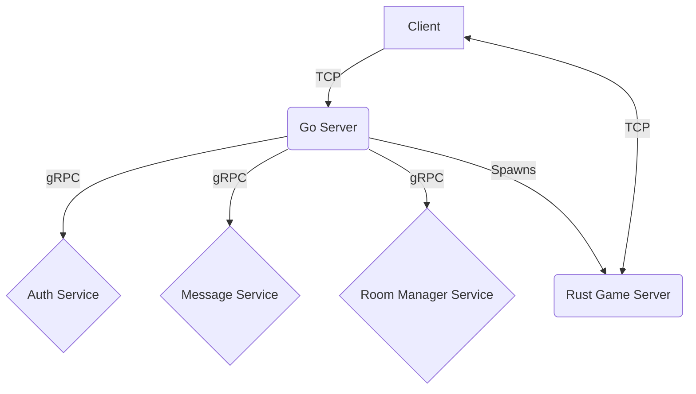

# TermArena - Real-Time MOBA Game

A real-time multiplayer online battle arena (MOBA) game built with Rust and Go, featuring strategic combat, real-time messaging, and seamless player communication.

## Quick Start

```bash
git clone https://github.com/GrGLeo/ctf.git
cd ctf
make build
./run_app.sh
```

## Table of Contents

- [Overview](#overview)
- [Architecture](#architecture)
- [Components](#components)
- [Installation](#installation)
- [Usage](#usage)
- [Game Mechanics](#game-mechanics)
- [Networking](#networking)
- [Development](#development)
- [API Documentation](#api-documentation)
- [Troubleshooting](#troubleshooting)
- [Contributing](#contributing)

## Overview

TermArena evolved from a Capture The Flag game to a full-featured MOBA with a complete rewrite of the core game logic in Rust. Players control champions on a dynamic board, engaging in strategic combat, fighting AI minions and champions, destroying enemy towers and bases. The game emphasizes real-time action, tactical decision-making, and seamless communication through integrated messaging.

### Key Features

- **Real-time Multiplayer Combat**: Fast-paced MOBA gameplay with basic strategy
- **Integrated Messaging**: Real-time player-to-player communication with broadcast and private messaging
- **Modular Architecture**: Separate services for game logic, authentication, and messaging
- **Cross-Platform**: Terminal-based client with server infrastructure
- **Extensible Design**: Plugin-based spell and item systems

## Architecture

The system uses a microservices architecture with specialized components communicating via TCP and gRPC protocols.



### Data Flow

1. **Authentication**: Client connects to Go Server → Auth Service verifies credentials
2. **Room Management**: Client requests room → Go Server queries Room Manager Service for room assignment → Room Manager Service handles matchmaking, team balancing, and room state
3. **Game Launch**: Go Server spawns dedicated Rust Game Server for each match when room is ready
4. **Real-time Gameplay**: Client connects directly to Rust Game Server for low-latency gameplay
5. **Messaging**: Client sends message to Go Server → Server queries Message Service for routes and parsed message → Message Service returns routes and parsed message to Server → Server distributes to receivers

## Components

### Core Services

- **`services/game/` (Rust)**: High-performance game engine handling real-time game state, physics, AI, and combat mechanics
- **`server/` (Go)**: Central orchestrator managing client connections, matchmaking, and service coordination
- **`client/` (Go)**: Terminal-based user interface with real-time rendering and input handling
- **`services/auth/` (Rust)**: Secure authentication service using RSA challenge-response mechanism
- **`services/message_service/` (Go)**: Real-time messaging system supporting broadcast and private messages
- **`services/room_manager_service/` (Go)**: Room lifecycle management, player matchmaking, and team balancing

### Supporting Infrastructure

- **Protocol Buffers**: Cross-language communication definitions
- **Event-Driven Architecture**: Decoupled component communication
- **Concurrent Design**: High-performance concurrent processing

## Installation

### Prerequisites

- **Go 1.19+** (for server, client, and message service)
- **Rust 1.70+** (for game engine and auth service)
- **Make** (build automation)
- **Git** (version control)

### Build Process

1. **Clone the repository**:
   ```bash
   git clone https://github.com/GrGLeo/ctf.git
   cd ctf
   ```

2. **Build all components**:
   ```bash
   make build
   ```

3. **Verify build**:
   ```bash
   make test
   ```

### Individual Component Builds

```bash
# Build Rust services
cd services/game && cargo build --release
cd services/auth && cargo build --release

# Build Go services
cd server && go build -o ../bin/server .
cd client && go build -o ../bin/client .
cd services/message_service && go build -o ../../bin/message_service .
cd services/room_manager_service/cmd && go build -o ../../../bin/room_manager_service .
```

## Usage

### Local Development

Run services in separate terminals:

```bash
# Terminal 1: Authentication Service
make run-auth

# Terminal 2: Message Service
make run-message

# Terminal 3: Room Manager Service
make run-room-manager

# Terminal 4: Game Server
make run-server

# Terminal 5: Client
make run-client
```

### Automated Setup

Use the provided script for full application launch:

```bash
./run_app.sh
```

This script handles:
- Environment setup
- Process cleanup
- Service startup order
- Log management
- Graceful shutdown

### Environment Configuration

Create a `.env` file for custom configuration:

```env
APP_ENV=development
SERVER_IP=localhost
LOG_LEVEL=info
```

## Game Mechanics

### Core Systems

#### Board System
- **Grid-based gameplay** with dynamic entity interactions
- **Real-time collision detection** and pathfinding
- **Strategic positioning** for tactical advantage

#### Entity Management
- **Champions**: Player-controlled characters with unique abilities
- **Minions**: AI-controlled units that push lanes and provide support
- **Towers**: Defensive structures protecting strategic objectives
- **Projectiles**: Skillshots and spells with collision detection

#### Combat Mechanics
- **Real-time action** with precise timing requirements
- **Spell casting system** with interruptible actions
- **Buff/Debuff mechanics** for status effects and crowd control
- **Resource management** (health, mana, gold)

### Advanced Features

#### Pathfinding & AI
- **Advanced algorithms** for obstacle navigation
- **Minion wave management** with intelligent spawning
- **Tower defense coordination** with threat assessment

#### Animation System
- **Visual feedback** for all game actions
- **Melee attack animations** with timing synchronization
- **Projectile trajectories** with collision visualization

#### Shop System
- **Item purchasing** with gold economy
- **Inventory management** with equipment slots
- **Strategic itemization** for match progression

## Networking

### Protocol Overview

The game uses a custom binary protocol with efficient packet structures for real-time communication.

#### Authentication Flow
Uses SSH-style challenge-response mechanism:
1. Client requests authentication challenge
2. Server provides unique challenge
3. Client signs challenge with private key
4. Server verifies signature via Auth Service

#### Game Communication
- **Go Server**: Lobby management, matchmaking, room coordination
- **Room Manager Service**: Room state management, player assignment, team balancing
- **Rust Game Server**: Real-time gameplay, state synchronization
- **Message Service**: Real-time player communication

### Packet Types

#### Lobby Packets (Codes 0-10)
- `RegisterRequestPacket` (0): New user registration
- `AuthRequestPacket` (4): Authentication with signed challenge
- `RoomRequestPacket` (6): Find available game rooms
- `GameStartPacket` (10): Match initialization

#### Game Packets (Codes 11-19)
- `ActionPacket` (11): Player actions (movement, spells)
- `BoardPacket` (12): Full game state updates
- `DeltaPacket` (13): Incremental state changes
- `SpellSelectionPacket` (16): Champion ability selection
- `ShopRequestPacket` (17): Item shop interface

#### Message Packets (Codes 100-102)
- `MessagePacket` (100): Send messages to other players
- `MessageResponsePacket` (101): Receive routed messages
- `MessageErrorPacket` (102): Error handling for messaging

## Development

### Project Structure

```
term_arena/
├── server/              # Go central server
├── client/              # Go terminal client
├── services/
│   ├── game/            # Rust game engine
│   ├── auth/            # Rust authentication service
│   ├── message_service/ # Go messaging service
│   └── room_manager_service/ # Go room management service
├── shared/              # Common Go utilities
├── pkg/proto/           # Protocol buffer definitions
├── docs/                # Documentation
├── scripts/             # Build and deployment scripts
└── bin/                 # Build outputs
```

### Development Workflow

1. **Setup development environment**:
   ```bash
   make build
   make test
   ```

2. **Run in development mode**:
   ```bash
   ./run_app.sh
   ```

3. **Monitor logs**:
   ```bash
   tail -f *.log
   ```

### Testing

```bash
# Run all tests
make test

# Run specific component tests
go test ./server/...
go test ./client/...
cd game && cargo test

# Run integration tests
cd test/e2e && go run game_simulation.go
```

## API Documentation

### Protocol Documentation
- [Networking Protocol](docs/detailed/networking.md) - Complete packet reference
- [Authentication Flow](docs/detailed/auth_rust.md) - Auth service integration
- [Message Service](docs/detailed/message_service.md) - Real-time messaging
- [Room Manager Service](docs/detailed/room_manager_service.md) - Room lifecycle and matchmaking

### Game Systems
- [Buff Mechanism](docs/detailed/game/buff_mechanism.md) - Status effect system
- [Casting Mechanism](docs/detailed/game/cast_mechanism.md) - Spell casting system
- [Projectile Mechanism](docs/detailed/game/projectile_mechanism.md) - Skillshot system

### Architecture
- [System Architecture](docs/architecture.md) - High-level design
- [Go Server](docs/detailed/server_go.md) - Server implementation
- [Game Server](docs/detailed/game_server_rust.md) - Game engine details

## Troubleshooting

### Common Issues

#### Build Failures
```bash
# Clean and rebuild
make clean
make build

# Check Rust toolchain
rustc --version
cargo --version

# Check Go version
go version
```

#### Service Startup Issues
```bash
# Check port availability
netstat -tlnp | grep :50051
netstat -tlnp | grep :8082
netstat -tlnp | grep :8083
netstat -tlnp | grep :8084

# Kill conflicting processes
sudo fuser -k 50051/tcp
sudo fuser -k 8082/tcp
sudo fuser -k 8083/tcp
```

#### Connection Problems
```bash
# Verify service status
ps aux | grep auth
ps aux | grep game
ps aux | grep server
ps aux | grep room_manager

# Check logs
tail -f auth.log
tail -f game.log
tail -f server.log
tail -f room_manager.log
```

### Debug Mode

Enable verbose logging:
```bash
export RUST_LOG=debug
export LOG_LEVEL=debug
./run_app.sh
```

### Performance Optimization

- **Memory**: Monitor Rust services for memory leaks
- **CPU**: Profile Go services for bottlenecks
- **Network**: Check latency between services
- **Database**: Optimize query performance

## Contributing

### Development Process

1. **Fork the repository**
2. **Create a feature branch**: `git checkout -b feature/new-mechanic`
3. **Make changes** following the established patterns
4. **Add tests** for new functionality
5. **Update documentation** as needed
6. **Submit a pull request**

### Code Standards

- **Go**: Follow standard Go conventions, use `gofmt`
- **Rust**: Follow Rust idioms, use `cargo fmt` and `cargo clippy`
- **Documentation**: Update relevant docs for API changes
- **Testing**: Maintain test coverage for critical paths

### Issue Reporting

- Use GitHub issues for bug reports and feature requests
- Include reproduction steps and environment details
- Attach relevant log files when reporting errors

---

**TermArena** - Bringing MOBA gameplay to the terminal with modern architecture and real-time performance.
