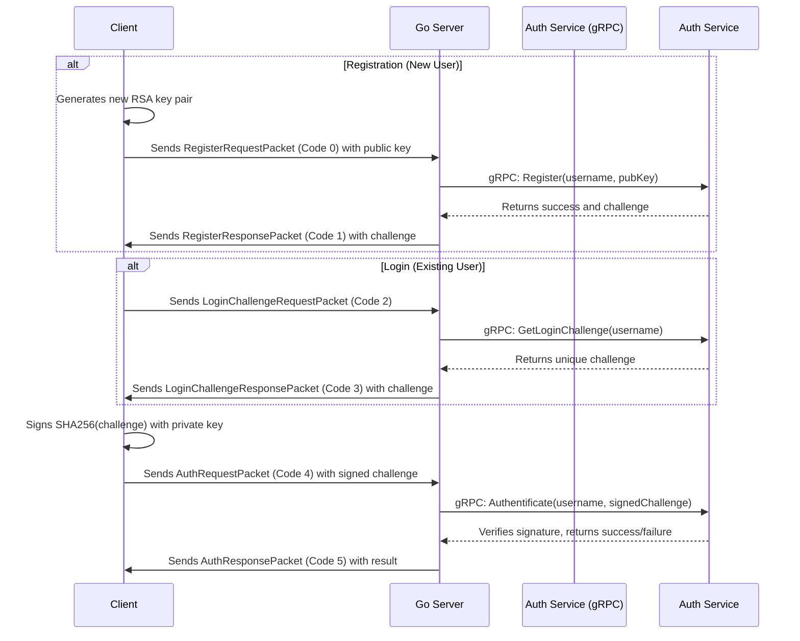
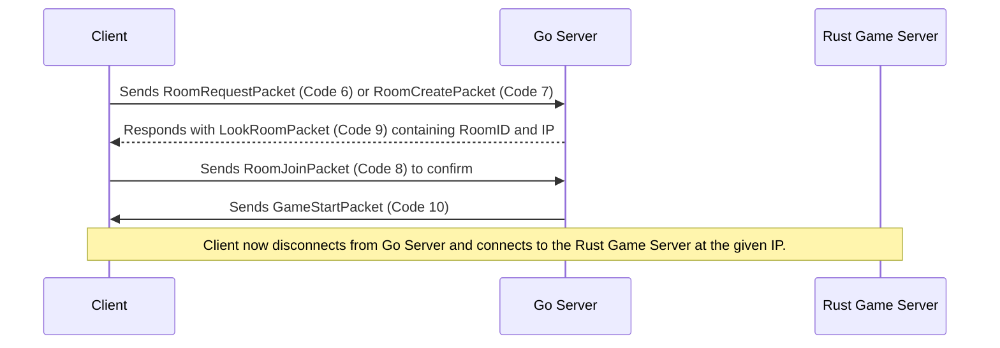
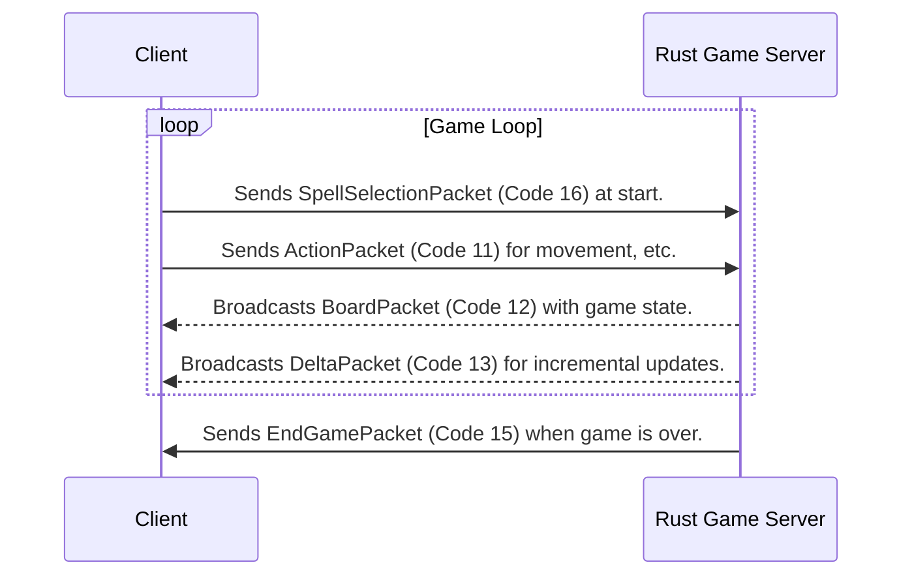
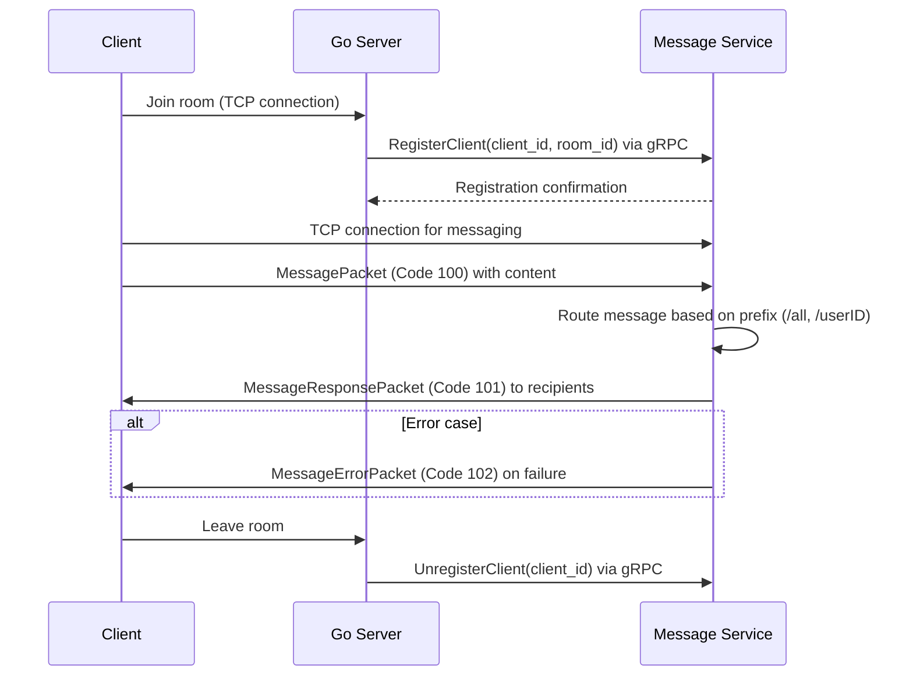

# Networking Protocol

The networking protocol defines how the different components of the CTF game communicate with each other. It is designed to be simple, efficient, and extensible. This document outlines the two primary communication channels: the Go-based lobby/authentication server and the Rust-based real-time game server.

## Communication Channels

- **Client to Go Server:** Handles authentication, account management, and game room orchestration.
- **Client to Rust Game Server:** Handles real-time gameplay communication once a match begins.
- **Go Server to Auth Service:** Internal gRPC communication for user verification.

---

## Part 1: Go Server Communication (Lobby & Auth)

This channel is used for all pre-game activities. The client connects to the main Go server, which orchestrates authentication and room management.

### Common Packet Header

All packets on this channel share a common header.

```
Byte Offset: 0       1
             +-------+-------+
             |Version| Code  |
             +-------+-------+
Size (bytes):  1       1
```
- **Version (u8):** Protocol version (currently `1`).
- **Code (u8):** Packet type identifier.

### Authentication Flow (SSH-Style)

The authentication process uses a challenge-response mechanism similar to SSH, where a client proves its identity by signing a unique challenge with its private key.



### Room Management Flow

This diagram illustrates how a client finds and joins a game room.



### Go Server Packet Reference

#### `RegisterRequestPacket` (Code 0)
- **Direction:** Client -> Server
- **Purpose:** Registers a new user by providing a username and a public key.
- **Structure:**
  ```
  Byte Offset: 0       1       2       3       4         X         X+1     X+2
               +-------+-------+-------+-------+---------+---------+-------+----------+
               |Version| Code  |  Username Len | Username| PubKey Len| Public Key ...
               +-------+-------+-------+-------+---------+---------+-------+----------+
  Size (bytes):  1       1       2 (u16)         (var)     2 (u16)   (var)
  ```

#### `RegisterResponsePacket` (Code 1)
- **Direction:** Server -> Client
- **Purpose:** Responds to a registration request. On success, it also provides an initial challenge to proceed directly to login.
- **Structure:**
  ```
  Byte Offset: 0       1       2         3       4       5          Y        Y+1     Y+2
               +-------+-------+---------+-------+-------+----------+--------+-------+-------------+
               |Version| Code  | Success | Msg Len       | Message  | Chal Len       | Challenge ...
               +-------+-------+---------+-------+-------+----------+--------+-------+-------------+
  Size (bytes):  1       1       1 (bool)  2 (u16)         (var)      2 (u16)          (var)
  ```

#### `LoginChallengeRequestPacket` (Code 2)
- **Direction:** Client -> Server
- **Purpose:** Requests a login challenge for an existing user.
- **Structure:**
  ```
  Byte Offset: 0       1       2       3       4
               +-------+-------+-------+-------+----------+
               |Version| Code  |  Username Len | Username |
               +-------+-------+-------+-------+----------+
  Size (bytes):  1       1       2 (u16)         (var)
  ```

#### `LoginChallengeResponsePacket` (Code 3)
- **Direction:** Server -> Client
- **Purpose:** Provides a unique, single-use challenge to the client.
- **Structure:**
  ```
  Byte Offset: 0       1       2       3       4
               +-------+-------+-------+-------+-------------+
               |Version| Code  |  Challenge Len| Challenge ...
               +-------+-------+-------+-------+-------------+
  Size (bytes):  1       1       2 (u16)         (var, 32 bytes)
  ```

#### `AuthRequestPacket` (Code 4)
- **Direction:** Client -> Server
- **Purpose:** Sends the username and the challenge after it has been signed by the client's private key.
- **Structure:**
  ```
  Byte Offset: 0       1       2       3       4         X         X+1     X+2
               +-------+-------+-------+-------+---------+---------+-------+----------------------+
               |Version| Code  |  Username Len | Username| Sig Len | Signed Challenge ...
               +-------+-------+-------+-------+---------+---------+-------+----------------------+
  Size (bytes):  1       1       2 (u16)         (var)     2 (u16)   (var)
  ```

#### `AuthResponsePacket` (Code 5)
- **Direction:** Server -> Client
- **Purpose:** Responds to the authentication attempt with success or failure.
- **Structure:**
  ```
  Byte Offset: 0       1       2         3       4       5          Y        Y+1     Y+2
               +-------+-------+---------+-------+-------+----------+--------+-------+--------------------+
               |Version| Code  | Success | Msg Len       | Message  | Tok Len        | Session Token ...
               +-------+-------+---------+-------+-------+----------+--------+-------+--------------------+
  Size (bytes):  1       1       1 (bool)  2 (u16)         (var)      2 (u16)          (var)
  ```

#### `RoomRequestPacket` (Code 6)
- **Direction:** Client -> Server
- **Purpose:** Requests to find a public room.
- **Structure:**
  ```
  Byte Offset: 0       1       2
               +-------+-------+--------+
               |Version| Code  |RoomType|
               +-------+-------+--------+
  Size (bytes):  1       1       1
  ```

#### `RoomCreatePacket` (Code 7)
- **Direction:** Client -> Server
- **Purpose:** Requests to create a new private room.
- **Structure:**
  ```
  Byte Offset: 0       1       2
               +-------+-------+--------+
               |Version| Code  |RoomType|
               +-------+-------+--------+
  Size (bytes):  1       1       1
  ```

#### `RoomJoinPacket` (Code 8)
- **Direction:** Client -> Server
- **Purpose:** Confirms the client wants to join a specific room by its ID.
- **Structure:**
  ```
  Byte Offset: 0       1       2
               +-------+-------+------
               |Version| Code  | RoomID ...
               +-------+-------+------
  Size (bytes):  1       1       (variable, reads to end of packet)
  ```

#### `LookRoomPacket` (Code 9)
- **Direction:** Server -> Client
- **Purpose:** Responds to a room search request with connection details for a game server.
- **Structure:**
  ```
  Byte Offset: 0       1       2        3       4       5       6       7       8
               +-------+-------+--------+-------+-------+-------+-------+-----+------
               |Version| Code  | Success|       RoomID (fixed 5 bytes)        | RoomIP
               +-------+-------+--------+-------+-------+-------+-------+-----+------
  Size (bytes):  1       1       1       5                                    (variable, reads to end of packet)
  ```

#### `GameStartPacket` (Code 10)
- **Direction:** Server -> Client
- **Purpose:** Signals that the game is ready to start.
- **Structure:**
  ```
  Byte Offset: 0       1       2
               +-------+-------+--------+
               |Version| Code  | Success|
               +-------+-------+--------+
  Size (bytes):  1       1       1
  ```

#### `QuitRoomPacket` (Code 11)
- **Direction:** Client -> Server
- **Purpose:** Allows a player to quit their current room.
- **Structure:**
  ```
  Byte Offset: 0       1
               +-------+-------+
               |Version| Code  |
               +-------+-------+
  Size (bytes):  1       1
  ```

---

## Part 2: Rust Game Server Communication (In-Game)

Once a player joins a room, they connect to a dedicated Rust game server.

### In-Game Flow

This diagram shows the typical communication loop during a game.



### Rust Server Packet Reference

*Note: The packet header (Version, Code) is identical to the Go server packets.*

#### `ActionPacket` (Code 11)
- **Direction:** Client -> Server
- **Purpose:** Sends player actions like movement or casting.
- **Structure:**
  ```
  Byte Offset: 0       1       2
               +-------+-------+-------+
               |Version| Code  | Action|
               +-------+-------+-------+
  Size (bytes):  1       1       1
  ```

#### `BoardPacket` (Code 12)
- **Direction:** Server -> Client
- **Purpose:** Sends the full player-specific view of the game board and champion status.
- **Structure:**
  ```
  Byte Offset: 0       1       2        ...   18      19      20      21      22
               +-------+-------+---------+----+-------+-------+-------+-------+------------+
               |Version| Code  |  Fields...   |   XP Needed   |   Length      | Encoded Board Data ...
               +-------+-------+---------+----+-------+-------+-------+-------+------------+
  Size (bytes):  1       1       17               2 (u16)         2 (u16)         (variable)
  ```

#### `DeltaPacket` (Code 13)
- **Direction:** Server -> Client
- **Purpose:** Sends incremental, partial updates to the board state to save bandwidth.
- **Structure:**
  ```
  Byte Offset: 0       1       2       3       4       5         6         7       8       9       10
               +-------+-------+-------+-------+-------+---------+---------+-------+-------+-------+------
               |Version| Code  |        TickID         |Points[0]|Points[1]| Delta Count   | Deltas (3 bytes each)
               +-------+-------+-------+-------+-------+---------+---------+-------+-------+-------+------
  Size (bytes):  1       1       4 (u32)                 1        1         2 (u16)         (variable)
  ```

#### `GameClosePacket` (Code 14)
- **Direction:** Server -> Client
- **Purpose:** Signals that the game is closing.
- **Structure:**
  ```
  Byte Offset: 0       1       2
               +-------+-------+--------+
               |Version| Code  | Success|
               +-------+-------+--------+
  Size (bytes):  1       1       1
  ```
  - `Success`: `0` for won, `1` for lost, `2` for error.

#### `EndGamePacket` (Code 15)
- **Direction:** Server -> Client
- **Purpose:** Declares the winner at the end of the game.
- **Structure:**
  ```
  Byte Offset: 0       1       2
               +-------+-------+--------+
               |Version| Code  | Win    |
               +-------+-------+--------+
  Size (bytes):  1       1       1 (bool)
  ```

#### `SpellSelectionPacket` (Code 16)
- **Direction:** Client -> Server
- **Purpose:** Sends the player's chosen spells at the beginning of the match.
- **Structure:**
  ```
  Byte Offset: 0       1       2       3
               +-------+-------+-------+-------+
               |Version| Code  | Spell1| Spell2|
               +-------+-------+-------+-------+
  Size (bytes):  1       1       1       1
  ```

#### `ShopRequestPacket` (Code 17)
- **Direction:** Client -> Server
- **Purpose:** Requests the current shop state.
- **Structure:**
  ```
  Byte Offset: 0       1
               +-------+-------+
               |Version| Code  |
               +-------+-------+
  Size (bytes):  1       1
  ```

#### `ShopResponsePacket` (Code 18)
- **Direction:** Server -> Client
- **Purpose:** Sends player stats and inventory for the shop UI.
- **Structure:**
  ```
  Byte Offset: 0       1         ... 10     11      12
               +-------+-------+-----+-------+-------+-------+---------------+
               |Version| Code  | ... | Gold          | Inventory (6 x u16)   |
               +-------+-------+-----+-------+-------+-------+---------------+
  Size (bytes):  1       1       ...   2 (u16)          12 (6 * 2)
  ```

#### `PurchaseItemPacket` (Code 19)
- **Direction:** Client -> Server
- **Purpose:** Sent when a player attempts to buy an item.
- **Structure:**
  ```
  Byte Offset: 0       1       2       3
                 +-------+-------+-------+-------+
                 |Version| Code  |    ItemID     |
                 +-------+-------+-------+-------+
  Size (bytes):  1       1       2 (u16)
  ```

#### `RateLimitPacket` (Code 255)
- **Direction:** Server -> Client
- **Purpose:** Sent when a request is rate limited and cannot be processed.
- **Structure:**
  ```
  Byte Offset: 0       1
                 +-------+-------+
                 |Version| Code  |
                 +-------+-------+
  Size (bytes):  1       1
  ```

---

## Part 3: Message Service Communication (Real-time Messaging)

The Message Service handles real-time player-to-player communication through dedicated packet codes (100-102). Clients connect directly to the Message Service for messaging functionality while the Go Server coordinates room-based messaging.

### Message Flow



### Message Routing Patterns

The Message Service supports several routing patterns:

- **Broadcast (`/all`):** Messages sent to all players in the current room
- **Private (`/userID`):** Direct messages to a specific player
- **Room-based:** Messages scoped to the current game room
- **System Messages:** Automated messages from the server

## Message Service Packet Reference

The Message Service uses dedicated packet codes (100-102) for real-time messaging functionality.

#### `MessagePacket` (Code 100)
- **Direction:** Client -> Server
- **Purpose:** Sends a message from a client to be routed through the Message Service.
- **Structure:**
  ```
  Byte Offset: 0       1       2       3       4         X         X+1     X+2
                +-------+-------+-------+-------+---------+---------+-------+----------------------+
                |Version| Code  |  Sender Len   | Sender  |     Msg Len     | Message Content ...
                +-------+-------+-------+-------+---------+---------+-------+----------------------+
  Size (bytes):  1       1       2 (u16)         (var)     2 (u16)           (var)
  ```
- **Fields:**
  - `Sender Len`: Length of sender username (u16)
  - `Sender`: Username string (variable length)
  - `Msg Len`: Length of message content (u16)
  - `Message Content`: The actual message text (variable length, max 256 chars)

#### `MessageResponsePacket` (Code 101)
- **Direction:** Server -> Client
- **Purpose:** Delivers a routed message to the client.
- **Structure:**
  ```
  Byte Offset: 0       1       2       3       4
                +-------+-------+-------+-------+--------------------+
                |Version| Code  |  Msg Len      | Message Content ...
                +-------+-------+-------+-------+--------------------+
  Size (bytes):  1       1       2 (u16)         (var)
  ```
- **Fields:**
  - `Msg Len`: Length of message content (u16)
  - `Message Content`: The routed message text (variable length)

#### `MessageErrorPacket` (Code 102)
- **Direction:** Server -> Client
- **Purpose:** Reports an error in message processing or delivery.
- **Structure:**
  ```
  Byte Offset: 0       1       2       3       4
                +-------+-------+-------+-------+--------------------+
                |Version| Code  |  Error Len    | Error Message ...
                +-------+-------+-------+-------+--------------------+
  Size (bytes):  1       1       2 (u16)         (var)
  ```
- **Fields:**
  - `Error Len`: Length of error message (u16)
  - `Error Message`: Error description text (variable length)

---
