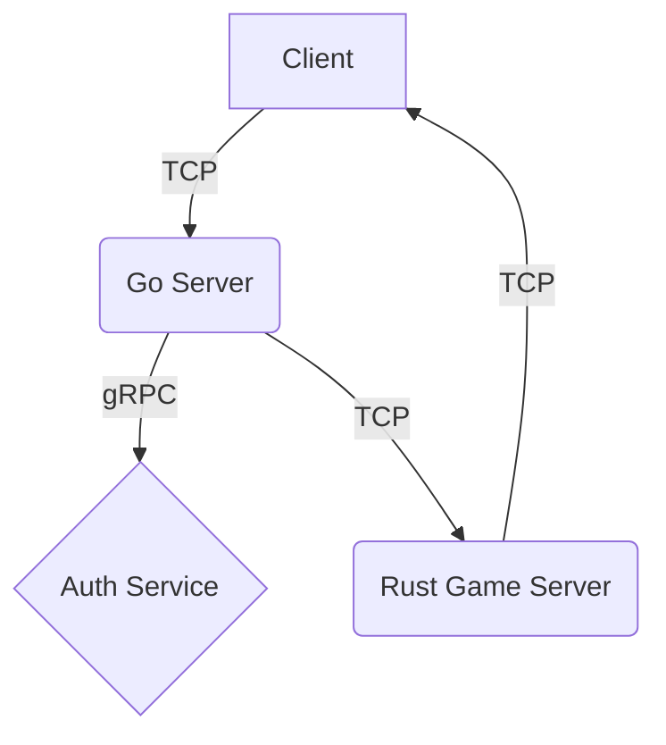

# CTF Game: System Architecture

This document provides a high-level overview of the CTF game's architecture. The system is composed of several key components that work together to provide a real-time multiplayer experience.

## Core Components

The system is divided into the following main components:

- **[Go Server](./server_go.md):** The central hub that manages client connections, authentication, and game room orchestration.
- **[Rust Game Server](./game_server_rust.md):** A dedicated server that runs the core game logic in real-time.
- **[Go Client](./client_go.md):** A terminal-based user interface (TUI) that allows players to interact with the game.
- **[Rust Auth Service](./auth_rust.md):** A gRPC service for user authentication and account management.
- **[Networking Protocol](./networking.md):** Defines the communication protocol between the various components.

## System Diagram

The following diagram illustrates the interaction between the different components:

### Data Flow

1.  **Client to Go Server:** The client initiates a connection to the Go server for authentication and to find or create a game room.
2.  **Go Server to Auth Service:** The Go server communicates with the Auth service via gRPC to verify user credentials.
3.  **Go Server to Rust Game Server:** Once a game room is ready, the Go server provides the client with the address of the Rust game server.
4.  **Client to Rust Game Server:** The client connects directly to the Rust game server to play the game.
5.  **Rust Game Server to Client:** The Rust game server sends real-time game state updates to the client.
