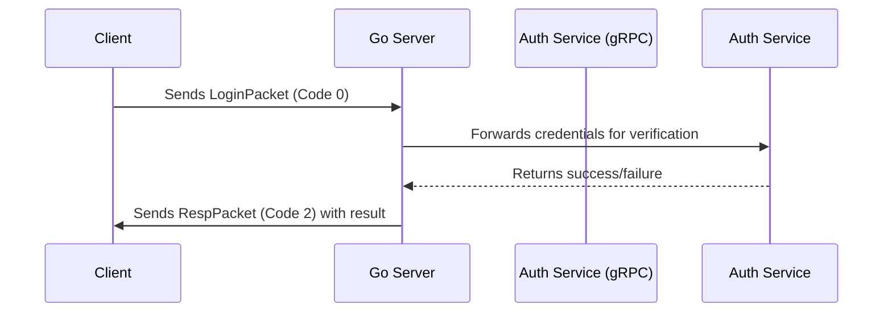
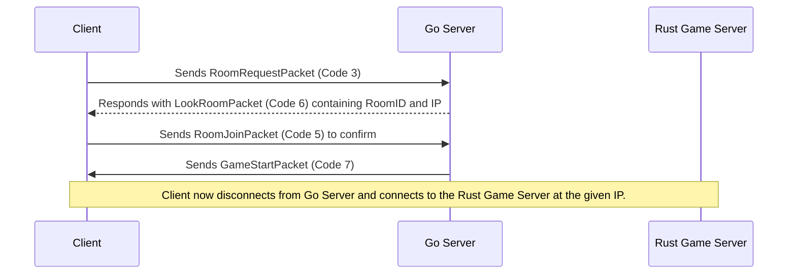
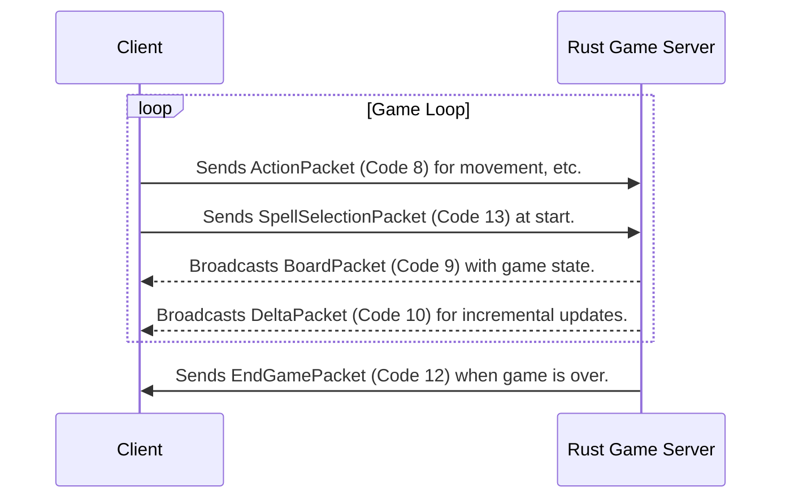

# Networking Protocol

The networking protocol defines how the different components of the CTF game communicate with each other. It is designed to be simple, efficient, and extensible. This document outlines the two primary communication channels: the Go-based lobby/authentication server and the Rust-based real-time game server.

## Communication Channels

- **Client to Go Server:** Handles authentication, account management, and game room orchestration.
- **Client to Rust Game Server:** Handles real-time gameplay communication once a match begins.
- **Go Server to Auth Service:** Internal gRPC communication for user verification.

---

## Part 1: Go Server Communication (Lobby & Auth)

This channel is used for all pre-game activities. The client connects to the main Go server, which orchestrates authentication and room management.

### Common Packet Header

All packets on this channel share a common header.

```
Byte Offset: 0       1
             +-------+-------+
             |Version| Code  |
             +-------+-------+
Size (bytes):  1       1
```
- **Version (u8):** Protocol version (currently `1`).
- **Code (u8):** Packet type identifier.

### Authentication Flow

The following diagram shows the sequence of packets for a user to log in.



### Room Management Flow

This diagram illustrates how a client finds and joins a game room.



### Go Server Packet Reference

#### `LoginPacket` (Code 0) & `SignInPacket` (Code 1)
- **Direction:** Client -> Server
- **Purpose:** Used by the client to send login or registration credentials.
- **Structure:**
  ```
  Byte Offset: 0       1       2       3       4         X       X+1     X+2    
               +-------+-------+-------+-------+---------+-------+---------------+----------------
               |Version| Code  |  Username Len | Username        |  Password Len | Password ...
               +-------+-------+-------+-------+---------+-------+---------------+----------------
  Size (bytes):  1       1       2               (variable)        2                (variable)
  ```

#### `RespPacket` (Code 2)
- **Direction:** Server -> Client
- **Purpose:** Responds to login/signin requests.
- **Structure:**
  ```
  Byte Offset: 0       1       2
               +-------+-------+--------+
               |Version| Code  | Success|
               +-------+-------+--------+
  Size (bytes):  1       1       1
  ```
  - `Success`: `1` for success, `0` for failure.

#### `RoomRequestPacket` (Code 3) & `RoomCreatePacket` (Code 4)
- **Direction:** Client -> Server
- **Purpose:** Requests to find a public room or create a new private room.
- **Structure:**
  ```
  Byte Offset: 0       1       2
               +-------+-------+--------+
               |Version| Code  |RoomType|
               +-------+-------+--------+
  Size (bytes):  1       1       1
  ```

#### `RoomJoinPacket` (Code 5)
- **Direction:** Client -> Server
- **Purpose:** Confirms the client wants to join a specific room by its ID.
- **Structure:**
  ```
  Byte Offset: 0       1       2    
               +-------+-------+------
               |Version| Code  | RoomID ...
               +-------+-------+------
  Size (bytes):  1       1       (variable, reads to end of packet)
  ```

#### `LookRoomPacket` (Code 6)
- **Direction:** Server -> Client
- **Purpose:** Responds to a room search request with connection details for a game server.
- **Structure:**
  ```
  Byte Offset: 0       1       2        3       4       5       6       7       8    
               +-------+-------+--------+-------+-------+-------+-------+-----+------
               |Version| Code  | Success|       RoomID (fixed 5 bytes)        | RoomIP
               +-------+-------+--------+-------+-------+-------+-------+-----+------
  Size (bytes):  1       1       1       5                                    (variable, reads to end of packet)
  ```

#### `GameStartPacket` (Code 7)
- **Direction:** Server -> Client
- **Purpose:** Signals that the game is ready to start.
- **Structure:**
  ```
  Byte Offset: 0       1       2
               +-------+-------+--------+
               |Version| Code  | Success|
               +-------+-------+--------+
  Size (bytes):  1       1       1
  ```

---

## Part 2: Rust Game Server Communication (In-Game)

Once a player joins a room, they connect to a dedicated Rust game server. The packet `Code` values in this context may differ from the Go server, so it's important to treat this as a separate protocol.

### In-Game Flow

This diagram shows the typical communication loop during a game.



### Rust Server Packet Reference

*Note: The packet header (Version, Code) is identical to the Go server packets.*

#### `StartPacket` (Code 7)
- **Direction:** Server -> Client
- **Purpose:** Confirms a successful connection to the game server.
- **Structure:**
  ```
  Byte Offset: 0       1       2
               +-------+-------+--------+
               |Version| Code  | Success|
               +-------+-------+--------+
  Size (bytes):  1       1       1
  ```

#### `ActionPacket` (Code 8)
- **Direction:** Client -> Server
- **Purpose:** Sends player actions like movement or casting.
- **Structure:**
  ```
  Byte Offset: 0       1       2
               +-------+-------+-------+
               |Version| Code  | Action|
               +-------+-------+-------+
  Size (bytes):  1       1       1
  ```

#### `BoardPacket` (Code 9)
- **Direction:** Server -> Client
- **Purpose:** Sends the full player-specific view of the game board and champion status.
- **Structure:**
  ```
  Byte Offset: 0       1       2         3         4       5       6       7       8       9       10      11      12      13      14      15      16      17      18      19      20      21      22
               +-------+-------+---------+---------+-------+-------+-------+-------+-------+-------+-------+-------+-------+-------+-------+-------+-------+-------+-------+-------+-------+-------+-------+------
               |Version| Code  |Points[0]|Points[1]|    Health     |  Max Health   |     Mana      |   Max Mana    | Level |       XP      |     XP Needed |   Length      | Encoded Board Data ...
               +-------+-------+---------+---------+-------+-------+-------+-------+-------+-------+-------+-------+-------+-------+-------+-------+-------+-------+-------+-------+-------+-------+-------+------
  Size (bytes):  1       1       1         1         2               2               2               2               1       4               4               2               (variable)
  ```

#### `DeltaPacket` (Code 10)
- **Direction:** Server -> Client
- **Purpose:** Sends incremental, partial updates to the board state to save bandwidth.
- **Structure:**
  ```
  Byte Offset: 0       1       2       3       4       5         6         7       8       9       10    
               +-------+-------+-------+-------+-------+---------+---------+-------+-------+-------+------
               |Version| Code  |        TickID         |Points[0]|Points[1]| Delta Count   | Deltas (3 bytes each)
               +-------+-------+-------+-------+-------+---------+---------+-------+-------+-------+------
  Size (bytes):  1       1       4                       1        1         2                (variable)
  ```

#### `GameClosePacket` (Code 11)
- **Direction:** Server -> Client
- **Purpose:** Signals that the game is closing.
- **Structure:**
  ```
  Byte Offset: 0       1       2
               +-------+-------+--------+
               |Version| Code  | Success|
               +-------+-------+--------+
  Size (bytes):  1       1       1
  ```
  - `Success`: `0` for won, `1` for lost, `2` for error.

#### `EndGamePacket` (Code 12)
- **Direction:** Server -> Client
- **Purpose:** Declares the winner at the end of the game.
- **Structure:**
  ```
  Byte Offset: 0       1       2
               +-------+-------+--------+
               |Version| Code  | Winner |
               +-------+-------+--------+
  Size (bytes):  1       1       1
  ```
  - `Winner`: `0` for Red Team, `1` for Blue Team.

#### `SpellSelectionPacket` (Code 13)
- **Direction:** Client -> Server
- **Purpose:** Sends the player's chosen spells at the beginning of the match.
- **Structure:**
  ```
  Byte Offset: 0       1       2       3       4
               +-------+-------+-------+-------+
               |Version| Code  | Spell1| Spell2|
               +-------+-------+-------+-------+
  Size (bytes):  1       1       1       1
  ```

#### `ShopRequestPacket` (Code 14)
- **Direction:** Client -> Server
- **Purpose:** Requests the current shop state.
- **Structure:**
  ```
  Byte Offset: 0       1
               +-------+-------+
               |Version| Code  |
               +-------+-------+
  Size (bytes):  1       1
  ```

#### `ShopResponsePacket` (Code 15)
- **Direction:** Server -> Client
- **Purpose:** Sends player stats and inventory for the shop UI.
- **Structure:**
  ```
  Byte Offset: 0       1       2       3       4       5       6       7       8       9       10      11      12      13      14      15      16      17      18      19      20      21      22      23
               +-------+-------+-------+-------+-------+-------+-------+-------+-------+-------+-------+-------+-------+-------+-------+-------+-------+-------+-------+-------+-------+-------+-------+-------+
               |Version| Code  |    Health     |     Mana      |    Damage     |     Armor     |     Gold      |       Inventory (6 x u16)                                                                     |
               +-------+-------+-------+-------+-------+-------+-------+-------+-------+-------+-------+-------+-------+-------+-------+-------+-------+-------+-------+-------+-------+-------+-------+-------+
  Size (bytes):  1       1       2               2               2               2               2               12 (6 * 2)
  ```

#### `PurchaseItemPacket` (Code 16)
- **Direction:** Client -> Server
- **Purpose:** Sent when a player attempts to buy an item.
- **Structure:**
  ```
  Byte Offset: 0       1       2       3
               +-------+-------+-------+-------+
               |Version| Code  |    ItemID     |
               +-------+-------+-------+-------+
  Size (bytes):  1       1       2
  ```

